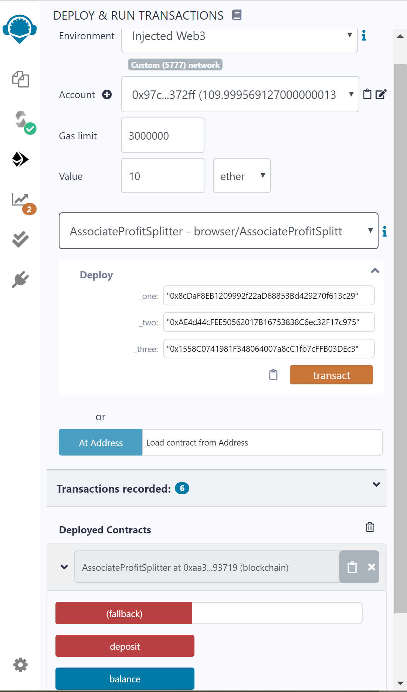
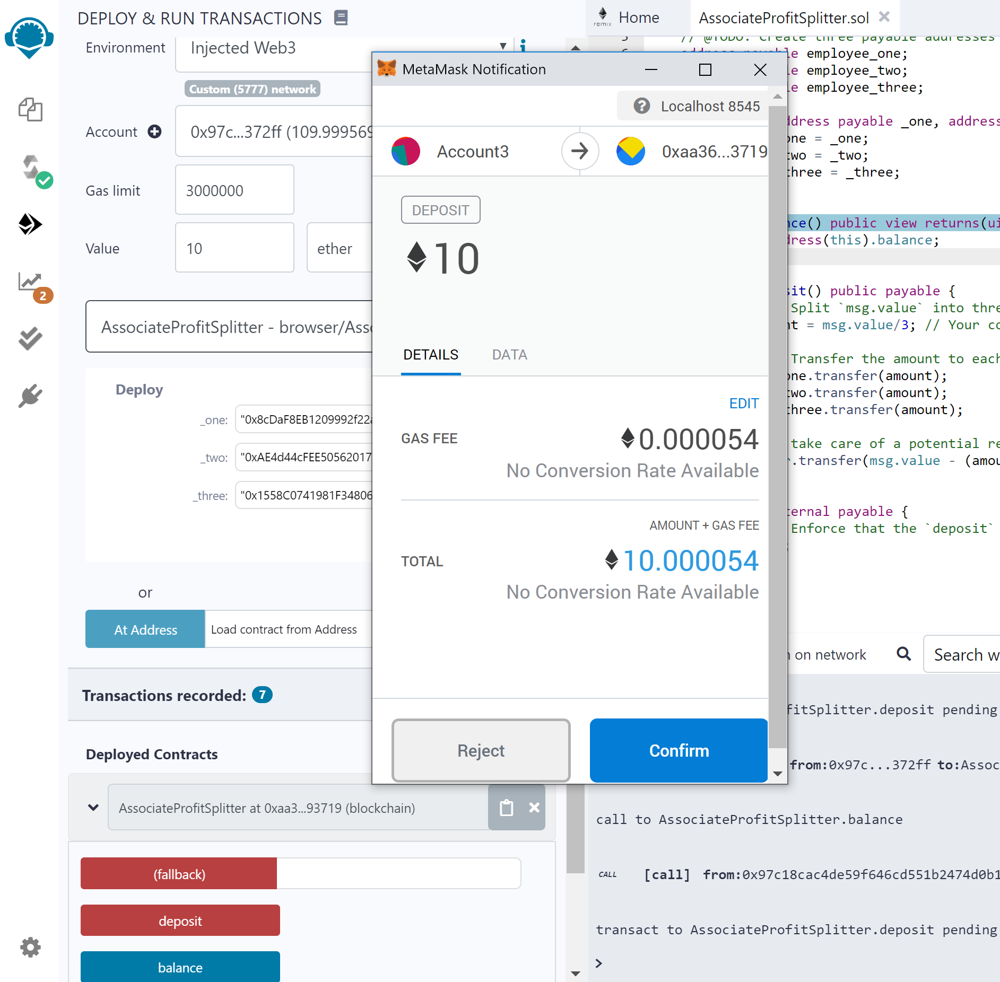
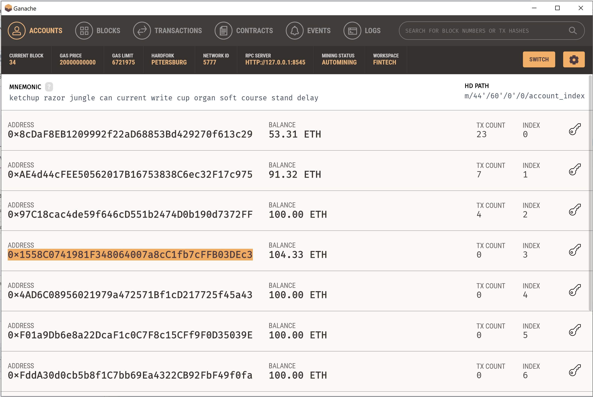
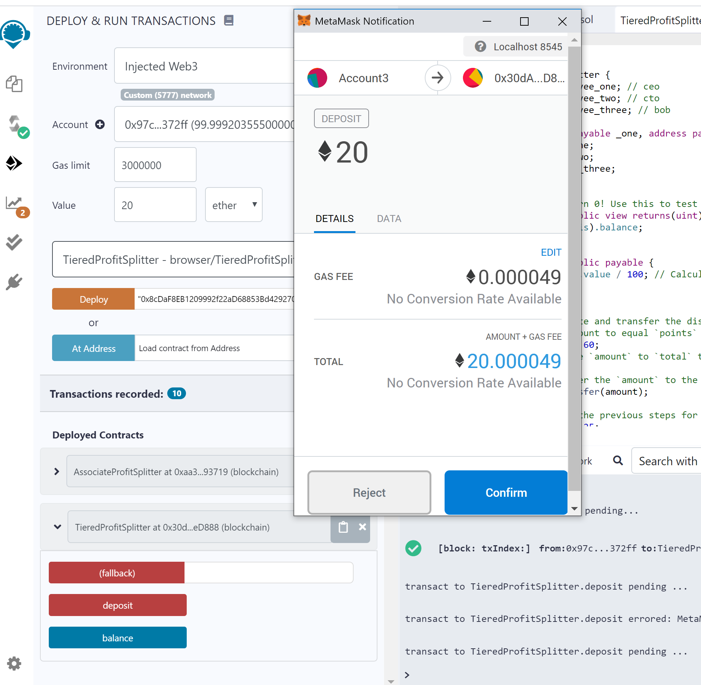
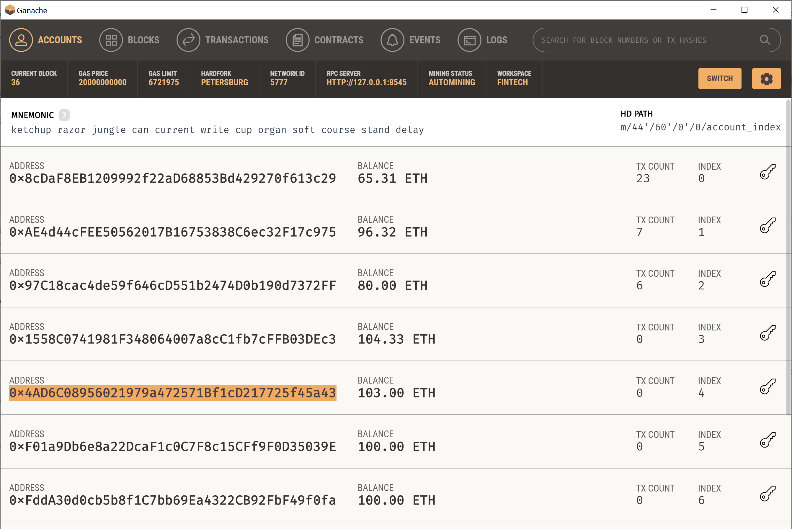

# Solidity_SmartContract

In this project three ProfitSplitter contracts were created.

AssociateProfitSplitter: Accepts Ether into the contract and divide the Ether evenly among the associate level employees

TieredProfitSplitter: Distributes different percentages of incoming Ether to employees at different tiers/levels. The CEO gets paid 60%, CTO 25%, and Bob gets 15%.

DeferredEquityPlan: This contract automatically manages 1000 shares with an annual distribution of 250 over 4 years for a single employee

## AssociateProfitSplitter

A value of 10 ether was split between 3 employees specified in deploy

## TieredProfitSplitter

